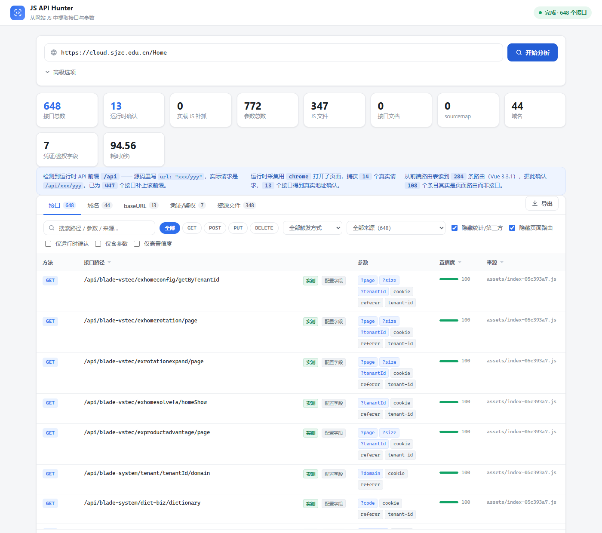

# JS API Hunter

> 输入一个网址，把前端页面里藏着的**接口地址**和**参数**全部扒出来 —— 静态分析 JS 源码 + 真实浏览器运行时采集，带可视化界面。

[](https://www.python.org/)
[](#工作原理)
[](#许可证)

---

## ✨ 特性

- **双通道采集**：静态分析（读 JS 源码）+ 运行时采集（真实浏览器跑一遍，抓实际发出的请求），互相补全。
- **接口还原**：字符串拼接、常量引用、别名链、模板字符串、二次封装调用、对象字面量式调用都能折叠成完整路径。
- **运行时前缀回填**：从 `VITE_BASE_URL` / `VUE_APP_BASE_API` / axios `baseURL` 推断前缀并补上，**顺序无关**。
- **Vue Router 路由表**：权威区分「页面路由」和「接口」，纠正命名启发式的误判。
- **OpenAPI 自动探测**：命中 `/v2/api-docs`、`/openapi.json` 等直接解析出全量接口与参数。
- **泄露凭据检测**：JS 里硬编码的密钥 / 令牌（JWT、AWS、Google、GitHub、Stripe、微信 AppID、PEM 私钥等 12 类）。
- **多目标 + 实时进度**：SSE 推送，逐个目标分析，可中途停止（保留已收集结果）。
- **多种导出**：JSON / CSV / Markdown / **HTTP 请求模板（`.http`）** / TXT。
- **零构建前端**：原生 HTML/JS/CSS，不依赖任何打包工具。
- **运行时复用系统浏览器**：直接复用已装的 Chrome / Edge，**不额外下载 Chromium**。
- **仅用于你有授权的站点**。

## 📸 界面预览



---

## 🚀 快速开始

### 环境要求

| 依赖 | 是否必需 | 说明 |
| --- | --- | --- |
| Python | **3.10+** | 建议 3.10 或以上 |
| `fastapi` | **必需** | Web 服务框架（`server.py` 顶层导入） |
| `uvicorn` | **必需** | ASGI 服务器，启动入口使用 |
| `httpx` | **必需** | 抓取页面 / JS 的 HTTP 客户端（`scanner.py` 顶层导入） |
| `playwright` | 可选 | 仅「运行时采集」需要；未安装时该阶段自动跳过，静态分析照常工作 |

> 只要静态分析能力，装前三个包即可，**不依赖任何浏览器**：
> `pip install fastapi uvicorn httpx`
> 要完整功能（真实浏览器跑页面），再 `pip install playwright`，并确保本机有 Chrome 或 Edge。

### 安装与启动

**Windows（一键）**

```bash
pip install -r requirements.txt
start.bat          # 浏览器自动打开 http://127.0.0.1:8765
```

> 浏览器是**等服务真的开始监听端口之后**才打开的（本机约 1.5~2 秒），直接开浏览器会停在一个空页面上。

**通用（任意平台）**

```bash
pip install -r requirements.txt
python server.py   # 然后浏览器打开 http://127.0.0.1:8765
```

> macOS / Linux 没有 `.bat`，用上面的 `python server.py` 即可。

### 停止服务

| 启动方式 | 怎么停 |
| --- | --- |
| 双击 `start.bat` | 关掉那个命令行窗口（或在窗口里按 `Ctrl+C`） |
| 命令行 `python server.py` | 在跑它的终端里按 `Ctrl+C` |
| **没有窗口可以按 Ctrl+C** | 双击 `stop.bat` —— 按「谁在监听 8765」找 PID 再结束，不依赖窗口 |

> 注意区分：界面上的**「停止」按钮**只中断当前这一次扫描任务，服务本身照旧运行，可以直接填下一个网址接着扫。要退出服务得用上面三种方式之一。

---

## 🖼️ 界面功能

| 区域 | 说明 |
| --- | --- |
| 摘要条 | 输入区收起后只剩这一条：目标 · 与默认值不同的选项 · 重置 / 停止 / 开始分析 · 展开 |
| 目标网址 | **支持多行，每行一个**（带 `http://` / `https://`；缺协议的按 `https://` 补） |
| 输入区折叠 | 点「开始分析」后输入区自动收成一条摘要，把高度让给结果；点「展开」改网址或选项 |
| 扫描选项 | 爬取深度 / 最多文件数 / 并发线程 / 最低置信度；运行时采集、显示浏览器、实载 JS 回灌、接口文档、sourcemap、分包 chunk、猜入口名、校验 HTTPS 等开关 |
| 多目标 | 多个网址**按顺序逐个分析**，每个目标一个独立任务，跑完一个渲染一个 |
| 实时进度 | SSE 推送，逐文件显示「XXX.js → 新增 N 个接口」 |
| 停止 | 真正中断：静态抓取秒级收手，运行时立刻关浏览器，已收集接口保留 |
| 接口页 | 目标站 / 方法 / 路径 / 参数 / 置信度 / 来源六列，支持搜索、按方法 / 触发方式 / 来源过滤；**路径前有跳转按钮**可新标签页打开；分页只属于这张表（20/50/100/200） |
| 详情 | 点行展开：参数表（名称/位置/类型/示例值）+ 触发方式 + 代码上下文 |
| 凭证/鉴权 | JS 里泄露的密钥与令牌，见下节 |
| 导出 | 固定在**输出区右上角**，JSON / CSV / Markdown / HTTP 请求模板 / TXT |

导出里的 **HTTP 请求模板**（`.http`）会按接口生成可直接用的原始请求（路径、query 占位、鉴权头、JSON body 骨架、正确 `Host`），可贴进 Burp Repeater / Postman，或被子 VS Code / JetBrains 的 HTTP Client 插件识别。工具本身**不会**发这些请求。

---

## 🔑 泄露凭据检测

「凭证/鉴权」页找的是 **JS 里硬编码的密钥、令牌**，三类证据按可信度递减：

1. **值的形态**：不看键名，只看值是否符合厂商格式。认 12 种：JWT（`eyJ…`）、阿里云 AccessKey（`LTAI…`）、AWS（`AKIA…`）、Google API（`AIza…`）、GitHub（`ghp_…`）、Slack（`xoxb-…`）、Stripe（`sk_live_…`）、OpenAI（`sk-…`）、SendGrid、npm Token、微信 AppID（`wx`+16 位十六进制）、PEM 私钥（`-----BEGIN … PRIVATE KEY-----`）。
2. **键名 + 值**：键名含 secret / password / apiKey / token / authorization 等，且值本身像凭据（**键名允许不带引号**，`const appSecret="…"`、`{appSecret:"…"}` 都能取值）。
3. **只有键名**：发现 token / Authorization / appId 之类字段，但值通常运行时才填，只提示去上下文看一眼。

> 启发式，仅供参考：结果是"这段 JS 里可能藏着这个"，不是"这个一定有效"，最好去上下文人工确认。

---

## ⚙️ 工作原理

1. **抓入口页** —— 解析 HTML，取出 `<script src>`、`modulepreload`、内联脚本、同源 `<a href>`。
2. **探测接口文档** —— 试 20 个常见地址（`/v2/api-docs`、`/openapi.json`、`/swagger-resources` 等），命中直接解析全量接口。
3. **展开 JS 资源** —— 递归还原 webpack chunk、拉取 sourcemap、必要时猜常见入口文件名。
4. **表达式折叠 + 静态扫描** —— 把 `"a" + x + "b"` 折叠成完整路径，再用「HTTP 调用上下文 + 业务关键词 + 路径形状」打分筛选。
5. **运行时采集** —— 用本机 Chrome 打开页面，从网络层记录 `xhr` / `fetch` / `websocket` / `beacon` / `EventSource` 的真实请求（最终 URL、请求头、post_data、状态码），滚动 + 跟随页面触发懒加载路由。**只监听，不篡改。**
6. **回灌 + 路由表** —— 把浏览器实载的 JS 清单用独立配额补抓；读 Vue Router 路由表区分「页面路由」与「接口」。
7. **汇总去重** —— 静态与运行时按 `(方法, 归一化地址)` 合并，按置信度排序，被观测到的接口打绿色「实测」标记。

---

## 🧪 测试

```bash
python selftest.py     # 引擎自测，不联网，68 项断言
python e2e_test.py https://www.bilibili.com 120   # 端到端，需先启动 server.py
python benchmark.py    # 准确率基准（联网，和基线对比）
```

自测覆盖字符串拼接 / 模板串 / 常量别名链 / 相对路径 / 二次封装 / 各类请求方式 / 路由表归一化 / 运行时前缀回填的顺序无关性 / **泄露凭据**（12 种密钥 × 3 种写法、11 种厂商格式、10 类反向用例）等。

---

## 📦 目录结构

```
js-api-hunter/
├── server.py            FastAPI 服务：扫描任务、SSE 进度、导出
├── start.bat / stop.bat Windows 一键启动 / 停止
├── requirements.txt     依赖清单（3 必需 + playwright 可选）
├── core/
│   ├── expr.py          表达式折叠：常量表、拼接链还原
│   ├── jsparse.py       JS 词法工具
│   ├── extractor.py     提取引擎：上下文识别、评分、参数解析、泄露凭据检测
│   ├── openapi.py       Swagger / OpenAPI 2 & 3 解析
│   ├── runtime.py       运行时采集：Playwright 驱动 + 网络层监听
│   ├── scanner.py       调度器：异步抓取、队列、限流、合并
│   └── models.py        数据模型
├── static/              前端（原生 JS，无构建步骤）
├── selftest.py          引擎自测（离线）
├── benchmark.py         准确率基准
├── benchmarks/          基准数据（各站标准答案 + 基线指标）
└── e2e_test.py          端到端测试
```

---

## 🔬 实测效果

**只做静态**：

| 站点 | 接口 | 参数 | JS 文件 | 耗时 |
| --- | --- | --- | --- | --- |
| petstore3.swagger.io | 25 | 56 | 3 | ~8s |
| cloud.sjzc.edu.cn | 264 | 193 | 60 | ~5s |
| segmentfault.com | 244 | 21 | 4 | ~3s |
| www.bilibili.com | 153 | 112 | 37 | ~37s |

**静态 + 运行时**：B 站接口从 153 → 223、参数从 112 → **600**（拿到真实 query 与请求头）；sjzc 从 264 → 715。运行时的价值主要体现在**参数**上。

在 B 站主 bundle 上对照人工标注做召回测试：**命中 38 / 40 = 95%**。

---

## ⚠️ 免责声明 / 合法使用

本项目**仅用于你有合法授权的站点**（自有项目、已获书面许可的渗透测试 / 安全评估等）。

- 静态阶段只读取公开的前端静态资源，**不会**去请求发现的接口；
- 运行时阶段会用浏览器真实打开一次目标页面，但同样**不会**主动请求列表里的接口；
- 请勿对未授权站点使用，后果自负。

---

## 📄 许可证

本项目**尚未指定许可证**。发布到 GitHub 前，请在仓库根目录添加 `LICENSE` 文件（常用 MIT / Apache-2.0）。

> 未添加许可证时默认「保留所有权利」，他人无权随意复制或修改。建议显式选一份。

---

## 🤝 贡献

欢迎提 Issue / PR。提交前请先跑通自测：`python selftest.py`（当前 68 项）。

## 📮 备注

参考思路：[jsluice](https://github.com/BishopFox/jsluice) · [URLFinder](https://github.com/pingc0y/URLFinder) · [xnLinkFinder](https://github.com/xnl-h4ck3r/xnLinkFinder)
